# Manual de Usuario Final — MarketWorld ERP

| Campo | Valor |
|---|---|
| **Versión** | 1.0.0 |
| **Fecha** | Junio de 2026 |
| **Programa de formación** | Tecnólogo en Análisis y Desarrollo de Software (ADSO) |
| **Ficha** | 3070470 |
| **Autores** | Armando Camacho Araque & Jhonatan Zuleta |
| **Instructor** | Stiven Silva Ascuntar |
| **Dirigido a** | Usuarios finales de la plataforma (sin conocimientos técnicos) |
| **Sistema** | MarketWorld ERP — Gestión empresarial para microempresas colombianas |

---

## Antes de comenzar

Este manual le guiará paso a paso en el uso de **MarketWorld ERP**, el sistema de gestión empresarial de su organización. No necesita conocimientos en sistemas o informática para seguir estas instrucciones. El sistema opera bajo una Arquitectura Desacoplada (Headless), garantizando un acceso rápido, seguro y optimizado desde cualquier navegador web.

**¿Qué necesita para usar el sistema?**

- ✅ Un computador con conexión a internet.
- ✅ Un navegador actualizado: Google Chrome, Mozilla Firefox, Microsoft Edge o Safari.
- ✅ Un correo electrónico y contraseña proporcionados por el administrador del sistema.

---

## Capítulo 1 — Inicio de sesión

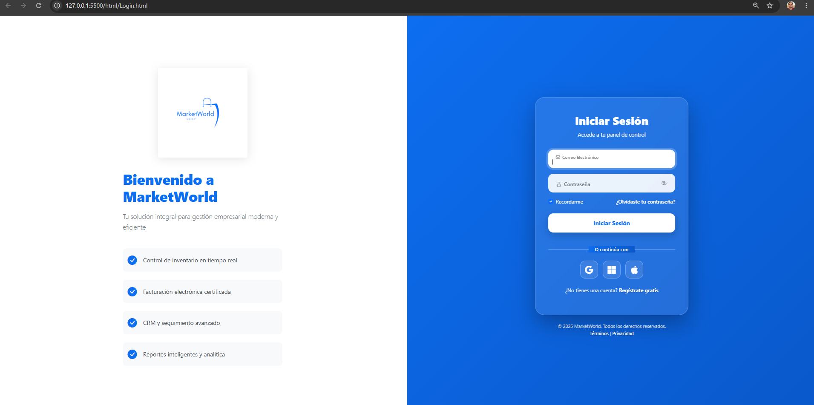

### ¿Cómo ingresar al sistema?

1. Abra su navegador de internet (Google Chrome, Firefox o Edge).
2. Escriba en la barra de dirección la URL exacta de producción: `https://marketworld-erp.vercel.app/html/Login.html`.
3. Verá la pantalla de inicio de sesión con dos campos: **Correo electrónico** y **Contraseña**.
4. Ingrese su correo electrónico institucional en el campo correspondiente.
5. Ingrese su contraseña. Por seguridad, los caracteres no se muestran en pantalla.
6. Haga clic en el botón **"Ingresar"**.

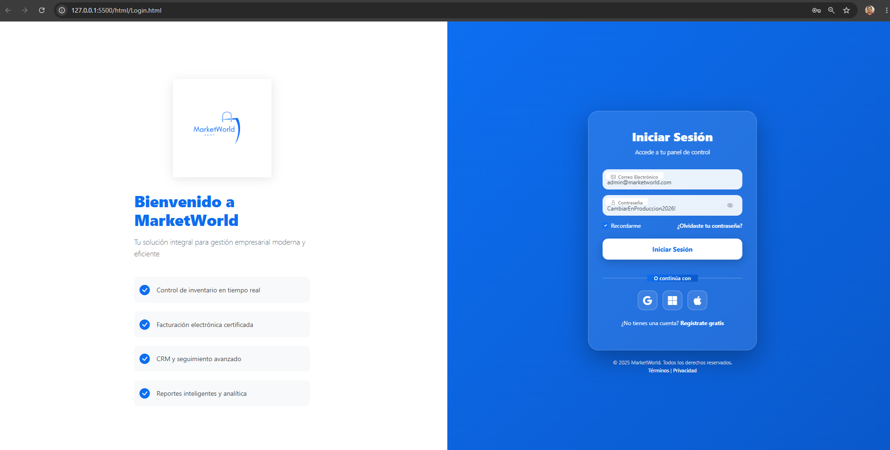

### ¿Qué pasa si ingreso mal mi contraseña?

Si los datos son incorrectos, el sistema mostrará un mensaje de error en rojo: _"Credenciales inválidas"_. Verifique que su correo no tenga errores de tipografía y que el bloqueo de mayúsculas (Caps Lock) esté desactivado.

### ¿Olvidé mi contraseña, qué hago?

Contacte al administrador del sistema. Él o ella podrá restablecer su contraseña desde el módulo de Administración.

> **Importante:** Nunca comparta su contraseña con nadie, ni siquiera con el administrador. Si alguien le solicita su contraseña, repórtelo inmediatamente.

---

## Capítulo 2 — Panel de control (Dashboard)

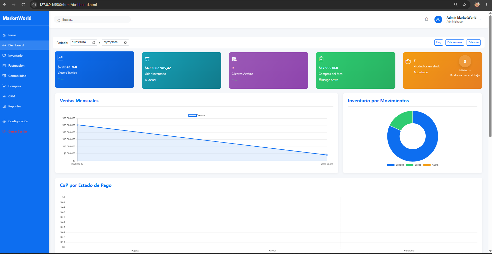

El **Dashboard** es la página de inicio que verá al ingresar al sistema. Es el centro de mando de MarketWorld ERP y le muestra un resumen en tiempo real del estado de su empresa.

### ¿Qué información muestra el Dashboard?

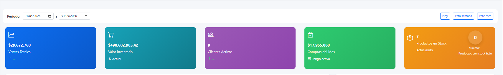

El Dashboard presenta **tarjetas de indicadores clave** (KPIs) en la parte superior:

| Tarjeta | ¿Qué muestra? |
|---------|---------------|
| 💰 **Ventas del día** | Total facturado en el día de hoy |
| 📊 **Ventas del período** | Total de ventas en el rango de fechas seleccionado |
| 🛒 **Compras del período** | Total de compras a proveedores en el período |
| 💳 **Cuentas por pagar** | Deuda pendiente con proveedores |
| 📦 **Productos con stock bajo** | Cantidad de productos que necesitan reabastecerse |
| 💵 **Valor del inventario** | Costo total del inventario actual |
| 👥 **Total de clientes** | Número de clientes registrados en el sistema |

### Gráficas históricas

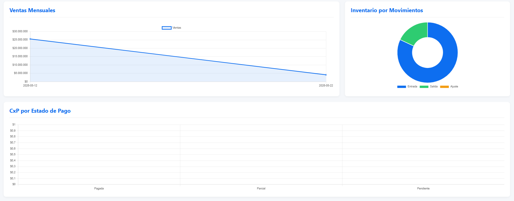

Debajo de las tarjetas encontrará tres gráficas:

1. **Historial de Ventas:** Muestra la evolución de las ventas en el tiempo. El sistema ajusta automáticamente la escala (por día, semana o mes) según el período seleccionado.
2. **Movimientos de Inventario:** Muestra las entradas, salidas y ajustes de stock.
3. **Estado de Cuentas por Pagar (CXP):** Muestra el estado de sus compras a crédito.

### Cómo cambiar el período de las gráficas

En la parte superior del Dashboard encontrará los campos **"Desde"** y **"Hasta"**. Haga clic en cada campo, seleccione las fechas deseadas y las gráficas se actualizarán automáticamente.

### Transacciones recientes

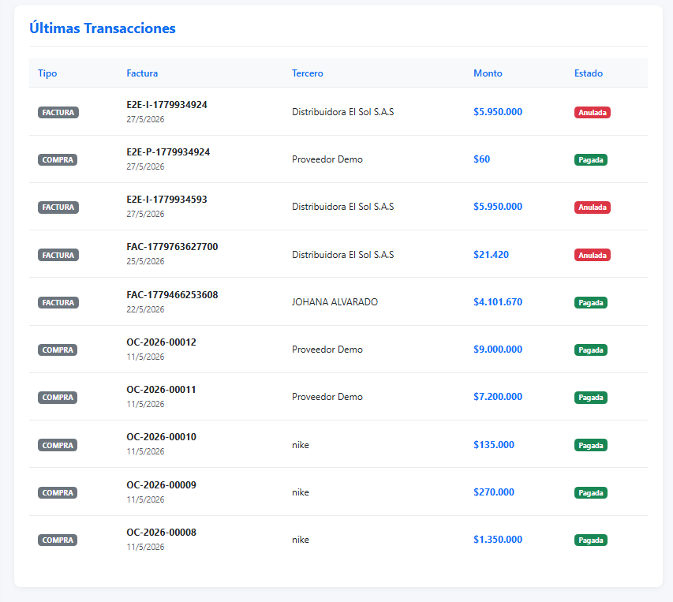

Al final del Dashboard verá una lista de las últimas facturas y compras registradas, con el nombre del cliente o proveedor, el monto y el estado.

---

## Capítulo 3 — Inventario

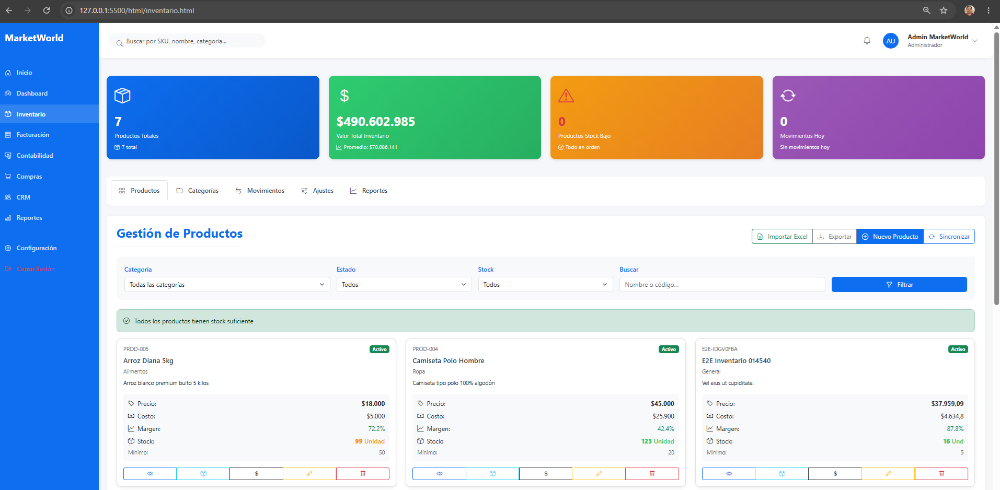

El módulo de **Inventario** le permite administrar todos los productos que su empresa vende o utiliza. Desde aquí puede agregar nuevos productos, actualizar precios, consultar el stock disponible y rastrear todos los movimientos.

### 3.1 Cómo agregar un nuevo producto

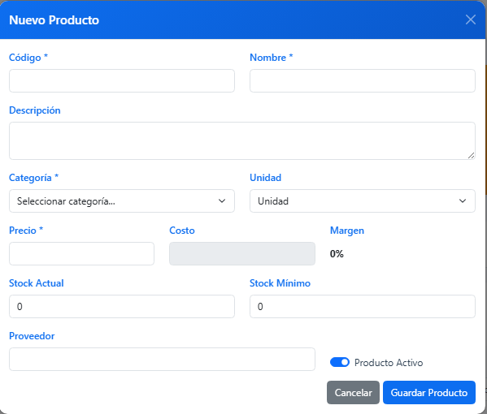

1. Haga clic en el botón **"+ Nuevo Producto"** (esquina superior derecha).
2. Se abrirá un formulario. Complete los siguientes campos:

| Campo | Descripción | Ejemplo |
|-------|-------------|---------|
| **Código** | Código único del producto. No puede repetirse. | `PROD-001` |
| **Nombre** | Nombre descriptivo del producto. | `Camiseta Polo Azul Talla M` |
| **Descripción** | Descripción detallada del producto. | `Camiseta polo de algodón 100% orgánico, cuello camisero, botones frontales, manga corta, color azul, talla M.` |
| **Categoría** | A qué grupo pertenece el producto. | `Ropa` |
| **Precio de compra** | Cuánto le costó a usted el producto. | `$25.000` |
| **Precio de venta** | A cuánto lo vende al cliente. | `$45.000` |
| **Stock inicial** | Cuántas unidades tiene disponibles ahora. | `50` |
| **Stock mínimo** | Cuándo quiere recibir una alerta de stock bajo. | `10` |
| **Estado** | Si el producto está disponible para venta. | `Activo` |

3. Haga clic en **"Guardar"**. El producto aparecerá en la lista.

> **¿Qué es el Código?** Es el código que identifica de forma única a cada producto en el sistema. Puede ser un código de barras, una referencia interna, etc.

### 3.2 Cómo buscar un producto

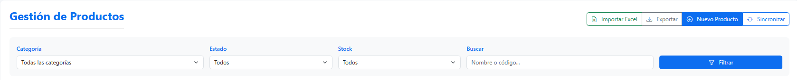

En la parte superior de la lista de productos encontrará una barra de búsqueda. Escriba el nombre del producto, el SKU o la categoría y la lista se filtrará automáticamente. También puede usar los menús desplegables para filtrar por **categoría** o **estado** (Activo / Inactivo).

### 3.3 Cómo editar la información de un producto

1. Localice el producto en la lista.
2. Haga clic en el ícono de **lápiz (✏️)** en la columna de acciones.
3. Modifique los datos que necesite.
4. Haga clic en **"Guardar cambios"**.

### 3.4 Cómo ajustar el stock manualmente

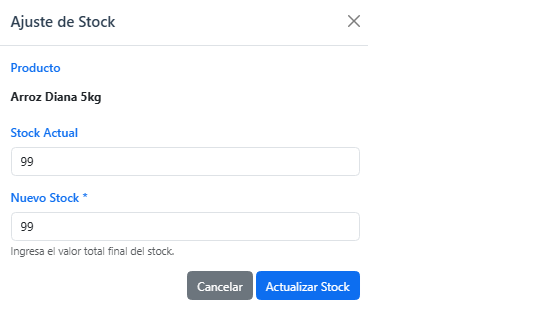

Si necesita corregir la cantidad de un producto (por ejemplo, después de un conteo físico de inventario):

1. Haga clic en el ícono de **ajuste (⚙️)** del producto.
2. Seleccione el tipo de movimiento: **Entrada** (suma unidades) o **Salida** (resta unidades).
3. Ingrese la cantidad a ajustar y el motivo del ajuste.
4. Haga clic en **"Registrar movimiento"**.

> **Importante:** Todos los ajustes quedan registrados en el historial de movimientos para mantener la trazabilidad del inventario.

### 3.5 Alertas de stock bajo

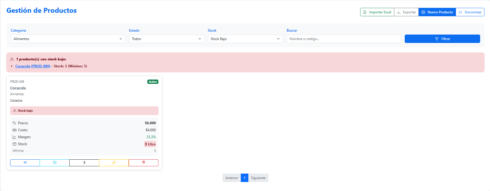

Los productos cuyo stock actual sea **igual o menor al stock mínimo** aparecerán resaltados en rojo/naranja en la lista y también se reportan en el Dashboard. Esto le indica que debe realizar una compra al proveedor.

---

## Capítulo 4 — Facturación (Ventas)

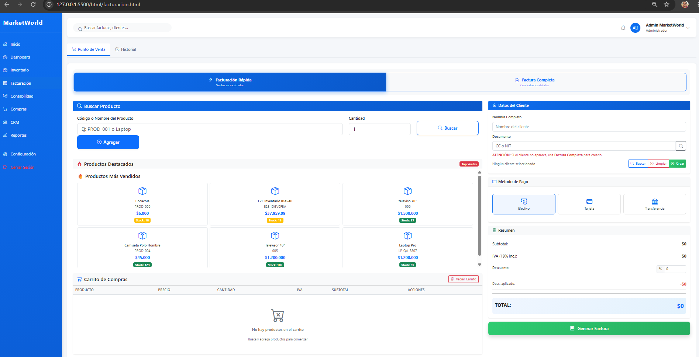

El módulo de **Facturación** le permite registrar todas las ventas a sus clientes. Al guardar una factura, el sistema descuenta automáticamente el stock de los productos vendidos.

### 4.1 Cómo crear una nueva factura

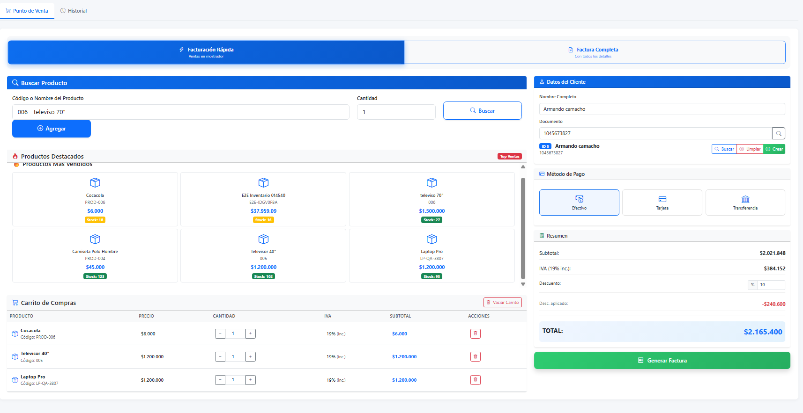

1. Haga clic en **"+ Nueva Factura"**.
2. **Seleccione el cliente:** Escriba el nombre del cliente en el campo de búsqueda. Si no lo encuentra, puede vender a "Consumidor Final" (sin asociar un cliente específico).
3. **Seleccione la fecha** de la venta.
4. **Agregue los productos:**
   - Haga clic en **"+ Agregar ítem"**.
   - Busque el producto por nombre o SKU.
   - Ingrese la cantidad a vender.
   - El sistema calculará automáticamente el subtotal con IVA incluido.
5. **Seleccione el método de pago:** Efectivo, Tarjeta o Transferencia.
6. Si aplica, ingrese un **descuento** en el campo correspondiente.
7. Revise el **total** en la parte inferior del formulario.
8. Haga clic en **"Generar Factura"**.

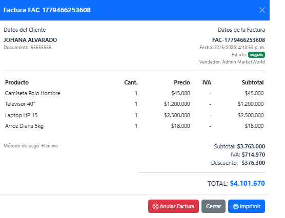

El sistema asignará automáticamente un número de factura correlativo (ej: `FAC-0001`, `FAC-0002`...).

### 4.2 Cómo consultar facturas emitidas

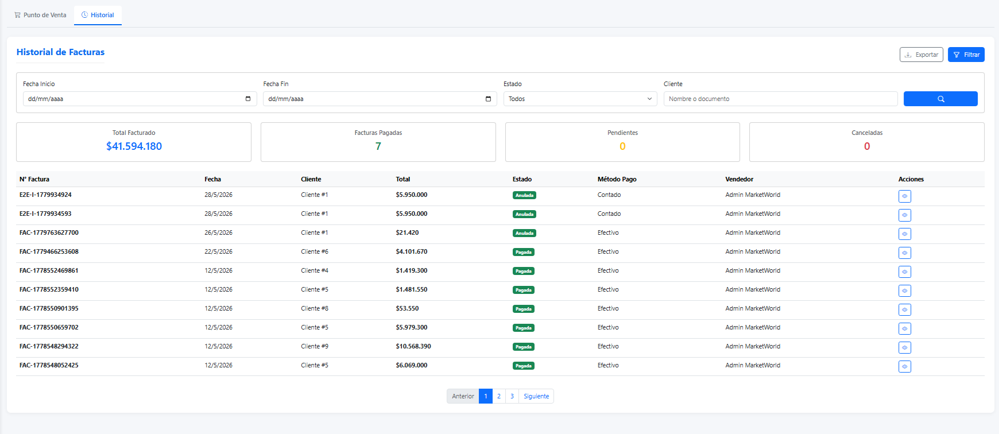

En la pantalla principal de Facturación verá la lista de todas las facturas. Puede filtrarlas por:
- **Fecha** (rango desde / hasta).
- **Estado:** Pagada, Pendiente o Anulada.
- **Cliente:** Escriba el nombre del cliente.

### 4.3 Cómo ver el detalle de una factura

Haga clic en el **número de factura** o en el ícono de ojo (👁️) para ver todos los detalles: cliente, productos vendidos, precios, IVA, descuentos y total.

### 4.4 Cómo anular una factura

> ⚠️ **Atención:** La anulación de facturas revierte el stock de los productos. Esta acción no se puede deshacer.

1. Abra el detalle de la factura que desea anular.
2. Haga clic en el botón **"Anular Factura"**.
3. Confirme la acción en la ventana de confirmación.
4. La factura quedará marcada como **"Anulada"** y el stock de los productos se restaurará.

---

## Capítulo 5 — Compras

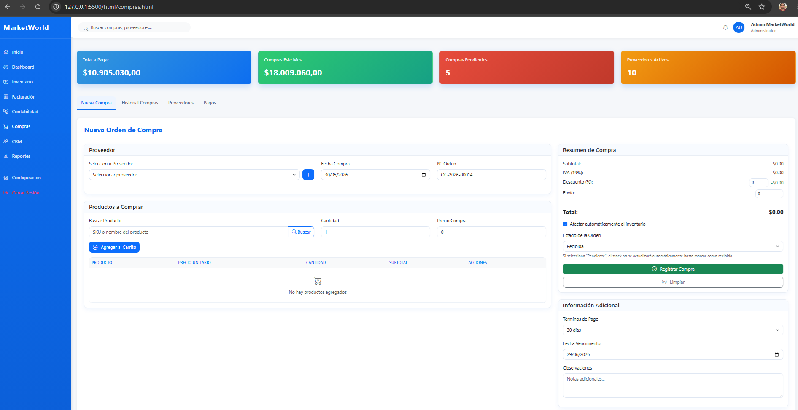

El módulo de **Compras** le permite registrar todas las entradas de mercancía desde sus proveedores. Al confirmar una compra, el stock de los productos se actualiza automáticamente y el sistema recalcula el costo promedio de cada producto.

> **Nota:** Este módulo está disponible únicamente para usuarios con rol **Administrador** o **Bodeguero**.

### 5.1 Cómo registrar una nueva orden de compra

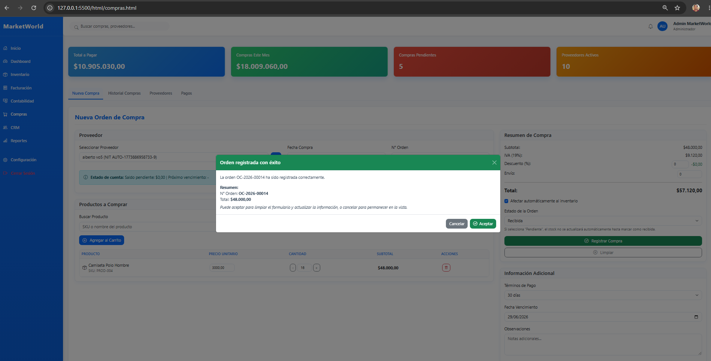

1. Haga clic en **"+ Nueva Compra"**.
2. **Seleccione el proveedor** del menú desplegable. Si no existe, créelo primero (ver sección 5.3).
3. **Seleccione la fecha** de la compra.
4. **Agregue los productos comprados:**
   - Haga clic en **"+ Agregar ítem"**.
   - Busque el producto.
   - Ingrese la **cantidad recibida** y el **precio unitario de compra**.
5. Agregue **observaciones** si es necesario (ej: número de remisión del proveedor).
6. Haga clic en **"Guardar Compra"**.

El sistema actualizará automáticamente el stock y recalculará el costo promedio ponderado de cada producto recibido.

### 5.2 Cómo registrar el pago a un proveedor

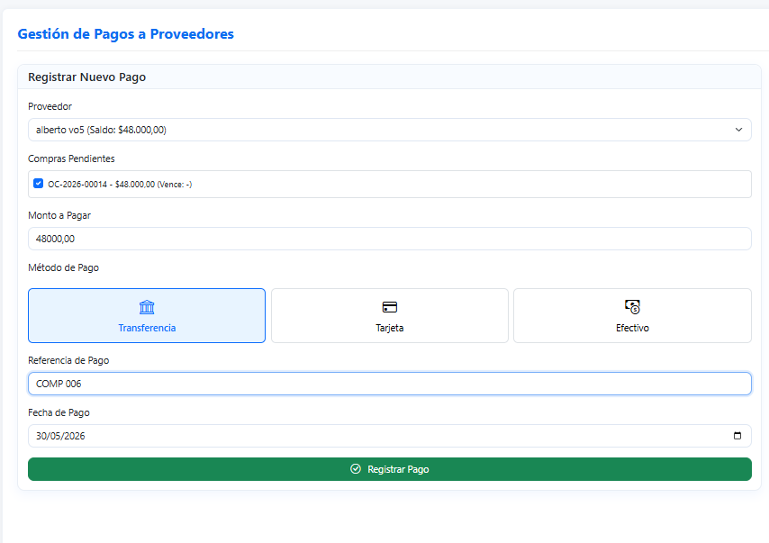

Si una compra quedó pendiente de pago o pagó en partes:

1. Vaya a la sección de **Pagos**.
2. Seleccione el proveedor.
3. Seleccione la compra pendiente. 
4. Haga clic en **"Registrar Pago"**.
5. Ingrese el **monto pagado**, la **fecha** y el **método de pago**.
6. El sistema calculará el saldo pendiente. Si el monto pagado cubre el total, la compra pasará a estado **"Pagada"**.

### 5.3 Cómo gestionar proveedores

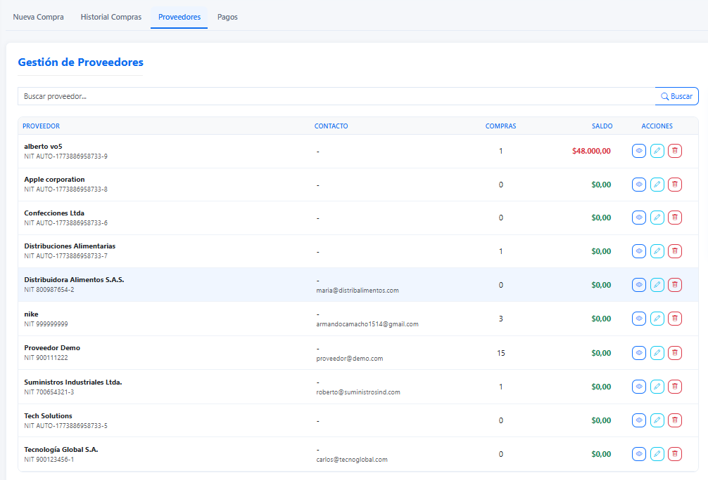

Desde la pestaña **"Proveedores"** puede:
- **Crear un proveedor:** Haga clic en **"+ Nuevo Proveedor"** e ingrese: nombre, NIT, contacto, teléfono y correo.
- **Editar un proveedor:** Haga clic en el ícono de lápiz (✏️).
- **Eliminar un proveedor:** Haga clic en el ícono de basura (🗑️). Solo puede eliminar proveedores que no tengan compras asociadas.

---

## Capítulo 6 — CRM (Gestión de Clientes)

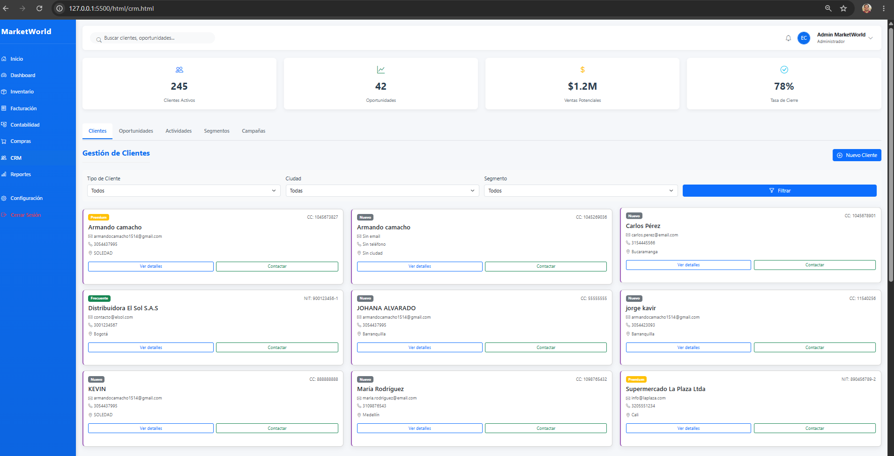

El módulo de **CRM** (Customer Relationship Management) le permite gestionar de manera integral las relaciones con sus clientes: desde el registro básico hasta el seguimiento de oportunidades comerciales y actividades.

### 6.1 Cómo registrar un nuevo cliente

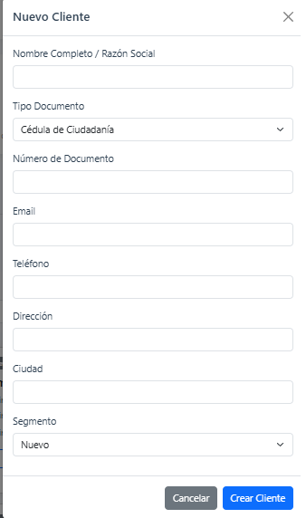

1. Haga clic en **"+ Nuevo Cliente"**.
2. Complete la información:

| Campo | Descripción |
|-------|-------------|
| **Nombre** | Nombre completo o razón social |
| **Tipo de documento** | CC, NIT, CE o Pasaporte |
| **Número de documento** | NIT o cédula del cliente |
| **Correo electrónico** | Email de contacto |
| **Teléfono** | Número de contacto |
| **Dirección / Ciudad** | Ubicación del cliente |
| **Tipo de cliente** | Persona Natural o Empresa |
| **Segmento** | Nuevo, Frecuente, Premium o Corporativo |

3. Haga clic en **"Guardar"**.

### 6.2 Cómo ver el historial de compras de un cliente

Haga clic en el nombre del cliente para abrir su perfil. En la pestaña **"Facturas"** verá todas las ventas asociadas a ese cliente, con montos y fechas.

### 6.3 Cómo gestionar oportunidades comerciales

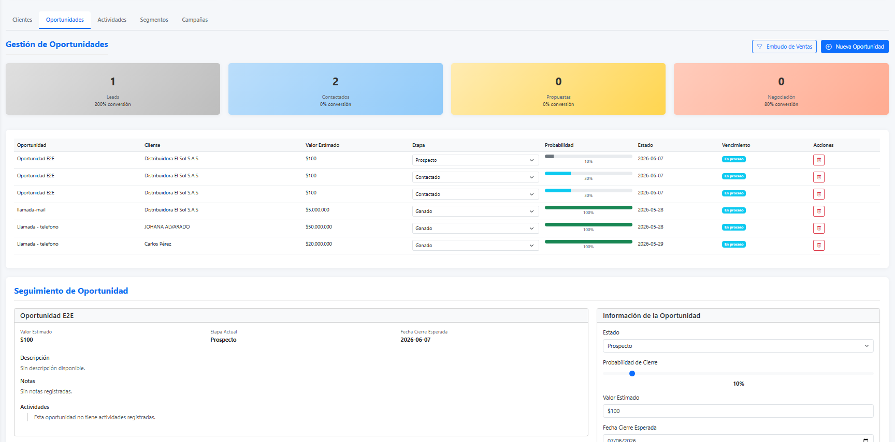

El **Pipeline de Oportunidades** le permite hacer seguimiento a las ventas potenciales. Cada oportunidad avanza por etapas:

`Prospecto` → `Contactado` → `Propuesta` → `Negociación` → `Ganado` / `Perdido`

Para crear una oportunidad:
1. Vaya a la pestaña **"Oportunidades"**.
2. Haga clic en **"+ Nueva Oportunidad"**.
3. Ingrese el cliente, el título, el valor estimado de la venta y la fecha estimada de cierre.
4. Haga clic en **"Guardar"**.

A medida que avance la negociación, actualice la **etapa** de la oportunidad para mantener el seguimiento actualizado.

### 6.4 Cómo registrar una actividad con un cliente

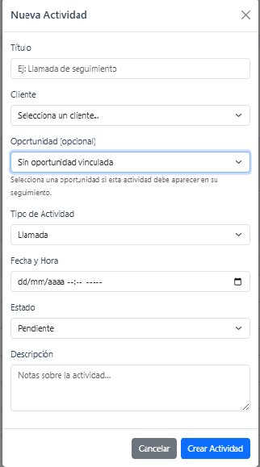

Las actividades son acciones realizadas con un cliente: llamadas, reuniones, correos, visitas, etc.

1. Vaya a la pestaña **"Actividades"**.
2. Haga clic en **"+ Nueva Actividad"**.
3. Seleccione el cliente, el tipo de actividad, la fecha y agregue una descripción.
4. Haga clic en **"Guardar"**.

---

## Capítulo 7 — Contabilidad

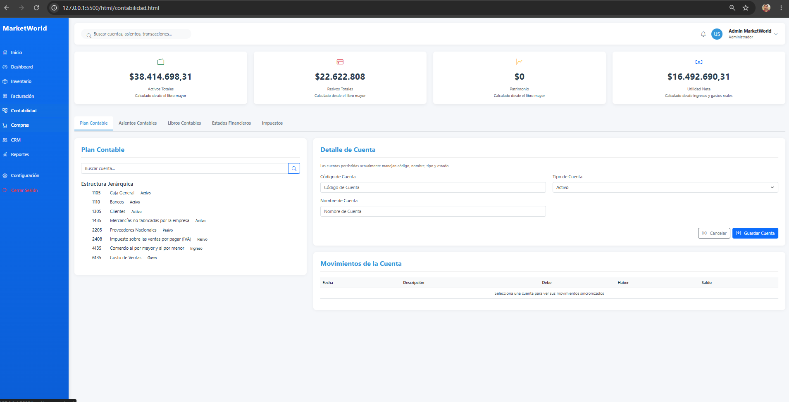

> **Nota:** Este módulo está disponible únicamente para usuarios con rol **Administrador**.

El módulo de **Contabilidad** permite llevar un registro básico de los movimientos financieros de la empresa mediante el sistema de **partida doble** (debe y haber). Cada venta y compra genera automáticamente un asiento contable.

### 7.1 Cómo ver el libro diario

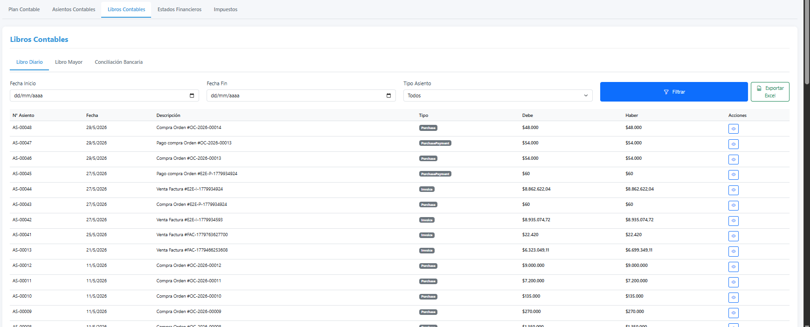

1. Acceda al módulo de **Contabilidad**.
2. Verá la lista de **asientos contables** ordenados por fecha.
3. Haga clic en cualquier asiento para ver sus partidas (débitos y créditos).

### 7.2 Cómo exportar el libro diario

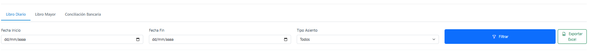

Para descargar el libro diario y compartirlo con su contador:

1. Haga clic en el botón **"Exportar Excel"** (`.xlsx`) o **"Exportar CSV"**.
2. El archivo se descargará automáticamente en su computador.
3. El archivo incluye: fecha, descripción del asiento, referencia, cuenta, débito y crédito.

### 7.3 Cómo gestionar el plan de cuentas

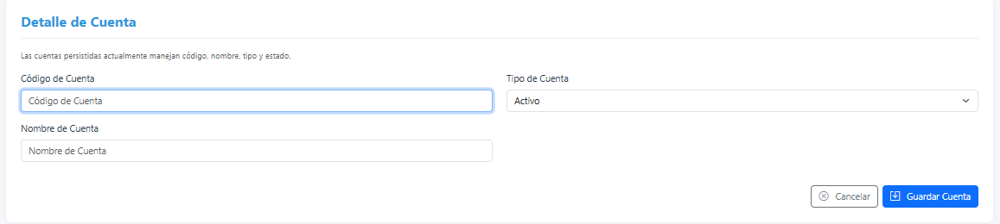

El **Plan de Cuentas** es la lista de todas las cuentas contables de la empresa. Para agregar una nueva cuenta:

1. Vaya a la pestaña **"Plan de Cuentas"**.
2. Haga clic en **"+ Nueva Cuenta"**.
3. Ingrese el **código** (según el PUC colombiano, ej: `1105` para Caja), el **nombre** y el **tipo** (Activo, Pasivo, Patrimonio, Ingreso o Gasto).
4. Haga clic en **"Guardar"**.

---

## Capítulo 8 — Reportes

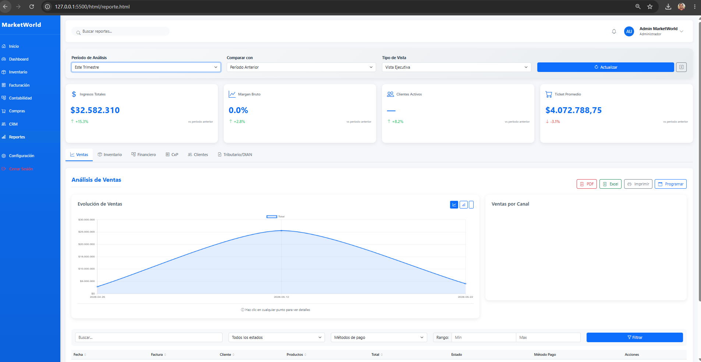

> **Nota:** Este módulo está disponible únicamente para usuarios con rol **Administrador**.

El módulo de **Reportes** le permite generar informes detallados para la toma de decisiones empresariales.

### 8.1 Tipos de reportes disponibles

| Reporte | ¿Qué muestra? |
|---------|---------------|
| **Ventas** | Detalle de facturas emitidas en un período, agrupadas por cliente o producto |
| **Inventario** | Valorización actual del inventario (stock × costo promedio) |
| **Financiero** | Comparativo de ingresos vs. gastos del período |
| **Cuentas por Pagar (CXP)** | Deudas pendientes con proveedores |
| **Clientes** | Ranking de clientes por volumen de compras |
| **Utilidad por producto** | Ganancia bruta por cada producto vendido |
| **Resumen de IVA** | IVA recaudado en ventas para declaración ante la DIAN |

### 8.2 Cómo generar un reporte

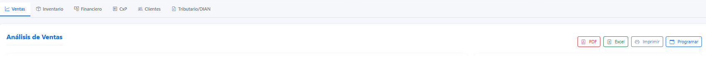

1. Seleccione el tipo de reporte del menú lateral o de las pestañas disponibles.
2. Defina el **período** con las fechas "Desde" y "Hasta".
3. Aplique filtros adicionales si están disponibles (por cliente, por producto, etc.).
4. Haga clic en **"Generar Reporte"**.
5. El informe aparecerá en pantalla con tablas y gráficas.
6. Para descargar, haga clic en **"Exportar"** (disponible en formatos PDF o Excel según el reporte).

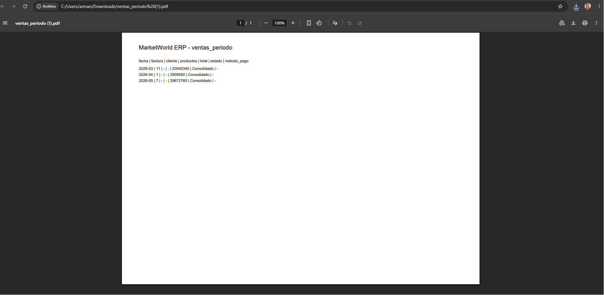

---

## Capítulo 9 — Configuración y Administración

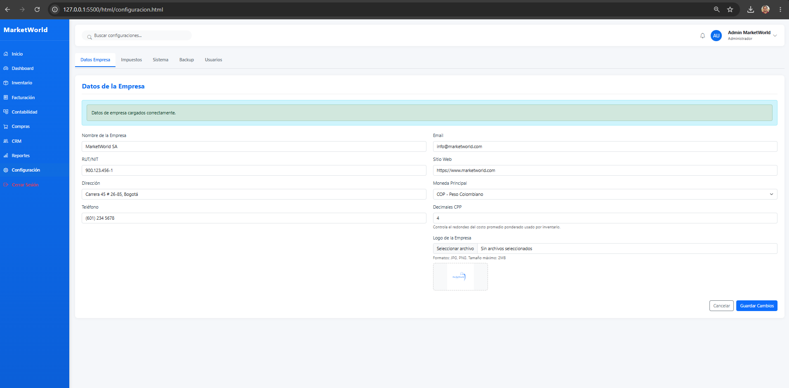

> **Nota:** Este módulo está disponible únicamente para usuarios con rol **Administrador**.

### 9.1 Cómo configurar la información de la empresa

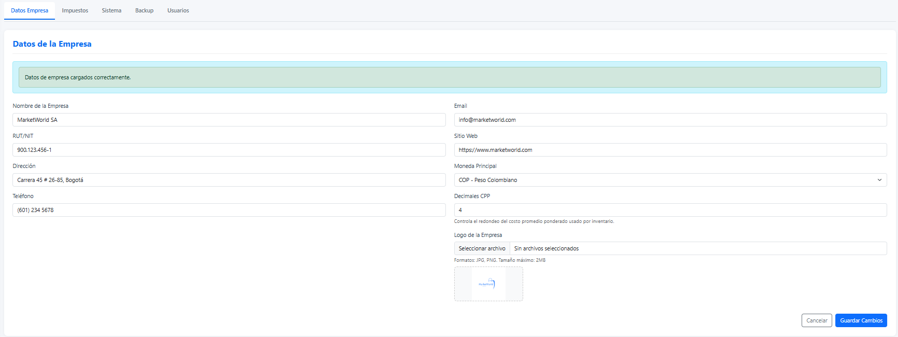

1. Acceda al módulo de **Configuración**.
2. En la sección **"Datos de la Empresa"** podrá actualizar:
   - Nombre de la empresa
   - NIT o número de identificación tributaria
   - Dirección, teléfono y correo corporativo
   - Sitio web
   - Moneda (por defecto: COP — Peso Colombiano)
   - Logo de la empresa
3. Haga clic en **"Guardar configuración"**.

### 9.2 Cómo agregar un nuevo usuario

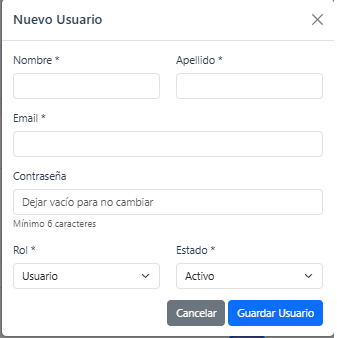

1. En la sección **"Gestión de Usuarios"**, haga clic en **"+ Nuevo Usuario"**.
2. Complete el formulario:

| Campo | Descripción |
|-------|-------------|
| **Nombre y Apellido** | Nombre completo del empleado |
| **Correo electrónico** | Será su usuario de acceso |
| **Contraseña** | Contraseña inicial (el usuario debe cambiarla al ingresar) |
| **Rol** | Administrador, Bodeguero o Usuario |

3. Haga clic en **"Guardar Usuario"**.

El nuevo usuario recibirá sus credenciales y podrá acceder al sistema inmediatamente.

### 9.3 Cómo asignar o cambiar roles a un usuario

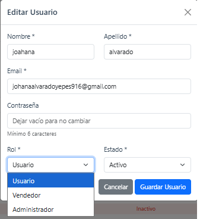

1. En la lista de usuarios, haga clic en el ícono de edición (✏️) del usuario que desea modificar.
2. Cambie el campo **"Rol"** al rol deseado.
3. Haga clic en **"Guardar cambios"**.

**¿Qué puede hacer cada rol?**

| Funcionalidad | Administrador | Bodeguero | Usuario |
|---------------|:---:|:---:|:---:|
| Dashboard | ✅ | ✅ | ✅ |
| Inventario (ver y editar) | ✅ | ✅ | ✅ |
| Facturación | ✅ | ❌ | ✅ |
| Compras y Proveedores | ✅ | ✅ | ❌ |
| CRM y Clientes | ✅ | ❌ | ✅ |
| Contabilidad | ✅ | ❌ | ❌ |
| Reportes | ✅ | ❌ | ❌ |
| Administración de usuarios | ✅ | ❌ | ❌ |
| Configuración de empresa | ✅ | ❌ | ❌ |
| Bitácora de auditoría | ✅ | ❌ | ❌ |

### 9.4 Cómo consultar la bitácora de auditoría

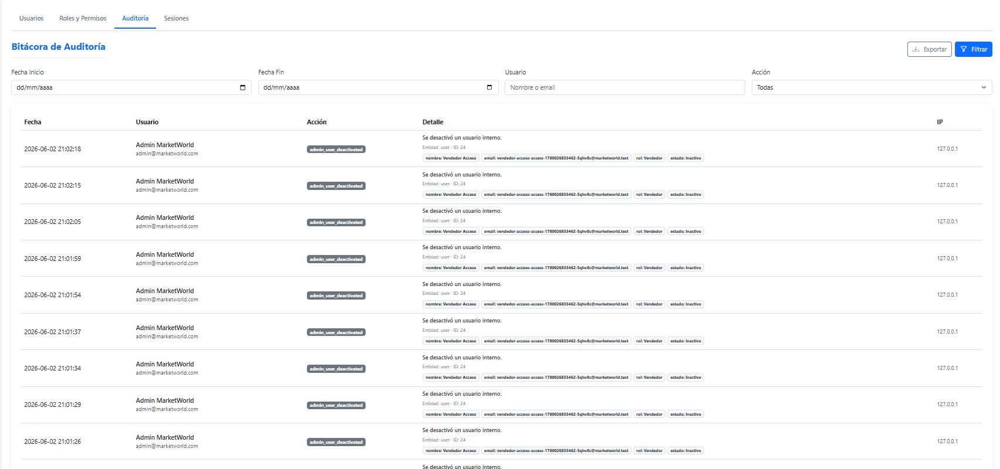

La **Bitácora de Auditoría** registra automáticamente todas las acciones importantes realizadas en el sistema: quién inició sesión, qué facturas creó, qué cambios realizó y desde qué dirección IP.

1. En la sección **"Auditoría"**, verá la lista de eventos ordenados de más reciente a más antiguo.
2. Puede filtrar por **usuario** o por **tipo de acción** (inicio de sesión, creación de factura, etc.).
3. Haga clic en cualquier registro para ver los detalles completos del evento.

### 9.5 Cómo gestionar las sesiones activas

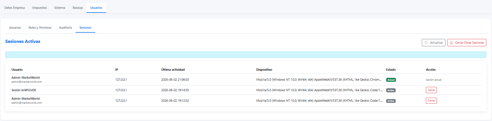

Desde la sección **"Sesiones activas"** puede ver todos los dispositivos donde hay una sesión abierta de su cuenta:

- Para cerrar una sesión específica (por ejemplo, si dejó la sesión abierta en otro computador), haga clic en **"Revocar"** en la sesión correspondiente.
- Para cerrar todas las sesiones excepto la actual, haga clic en **"Revocar todas las demás"**.

---

## Capítulo 10 — Notificaciones

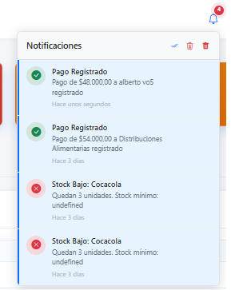

El sistema le envía notificaciones automáticas para alertarle sobre eventos importantes. El ícono de campana 🔔 en la barra superior mostrará el número de notificaciones sin leer.

**Tipos de notificaciones:**
- 📦 **Stock bajo:** Cuando un producto alcanza su nivel mínimo de inventario.
- 💳 **Compra vencida:** Cuando una orden de compra tiene saldo pendiente de pago.
- ✅ **Acción confirmada:** Cuando se completa una operación importante.

Para marcar todas las notificaciones como leídas, haga clic en **"Marcar todas como leídas"**.

---

## Capítulo 11 — Cómo cerrar sesión de forma segura

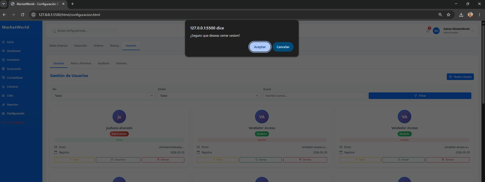

Siempre cierre su sesión cuando termine de usar el sistema, especialmente si está en un computador compartido:

1. Haga clic en su **nombre de usuario** en la esquina superior derecha de la pantalla.
2. Seleccione **"Cerrar sesión"** en el menú desplegable.
3. El sistema le redirigirá a la pantalla de inicio de sesión.

> ⚠️ **No cierre simplemente la ventana del navegador.** Use siempre el botón de "Cerrar sesión" para que su sesión quede completamente invalidada en el servidor y nadie más pueda acceder a su cuenta.

---

## Preguntas frecuentes

**¿El sistema funciona en mi celular?**
Sí, el sistema es responsivo y puede usarse desde el navegador de su teléfono o tablet, aunque se recomienda el uso en computador para una mejor experiencia.

**¿Puedo usar el sistema en varios computadores al mismo tiempo?**
Sí, puede tener la sesión abierta en múltiples dispositivos simultáneamente.

**¿Qué hago si la página no carga o aparece un error?**
1. Verifique que tenga conexión a internet.
2. Presione `Ctrl + F5` (o `Cmd + Shift + R` en Mac) para recargar la página limpiamente.
3. Si el error persiste, contacte al administrador del sistema e indíquele el mensaje de error que aparece en pantalla.

**¿El sistema guarda mis cambios automáticamente?**
No. Debe hacer clic en **"Guardar"** o **"Confirmar"** después de cada operación. Si cierra el formulario sin guardar, los cambios se perderán.

**¿Puedo recuperar un registro eliminado?**
No. Las eliminaciones en el sistema son permanentes. El administrador puede consultar la bitácora de auditoría para ver qué se eliminó y cuándo.

**¿Con qué frecuencia debo hacer una copia de seguridad de los datos?**
Esta tarea es responsabilidad del administrador del sistema. Se recomienda realizar copias de seguridad diariamente.

---

## Glosario de términos

| Término | Definición |
|---------|------------|
| **Código** | Código único que identifica a cada producto en el inventario. |
| **IVA** | Impuesto al Valor Agregado. En Colombia la tarifa general es del 19%. |
| **Stock** | Cantidad de unidades disponibles de un producto. |
| **Stock mínimo** | Nivel de inventario por debajo del cual se genera una alerta de reabastecimiento. |
| **Factura** | Documento que registra una venta y sus condiciones (cliente, productos, precios, impuestos). |
| **Orden de compra** | Documento que registra la adquisición de productos a un proveedor. |
| **CXP** | Cuentas por Pagar. Deudas pendientes con proveedores. |
| **CPP** | Costo Promedio Ponderado. Método de valorización de inventario que calcula el costo promedio de las unidades en stock. |
| **Pipeline** | Embudo de ventas. Representación visual del avance de las oportunidades comerciales. |
| **Rol** | Nivel de acceso de un usuario en el sistema (Administrador, Bodeguero o Usuario). |
| **Dashboard** | Panel de control con indicadores y gráficas en tiempo real. |
| **KPI** | Key Performance Indicator. Indicador clave de rendimiento empresarial. |
| **DIAN** | Dirección de Impuestos y Aduanas Nacionales de Colombia. |
| **NIT** | Número de Identificación Tributaria. Identificación fiscal de las empresas en Colombia. |
| **PUC** | Plan Único de Cuentas. Estándar contable colombiano. |
| **Auditoría** | Registro cronológico de todas las acciones realizadas en el sistema. |

---

*Manual de Usuario Final — MarketWorld ERP v1.0.0 — Mayo 2026*
*Para soporte técnico, contacte al administrador del sistema.*
